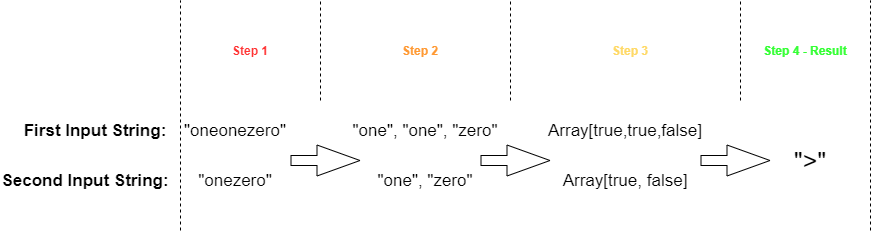
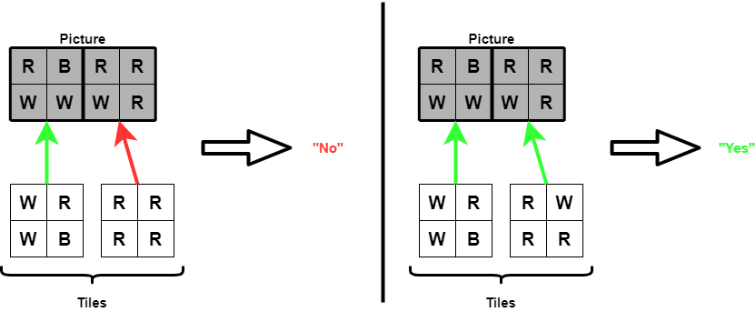
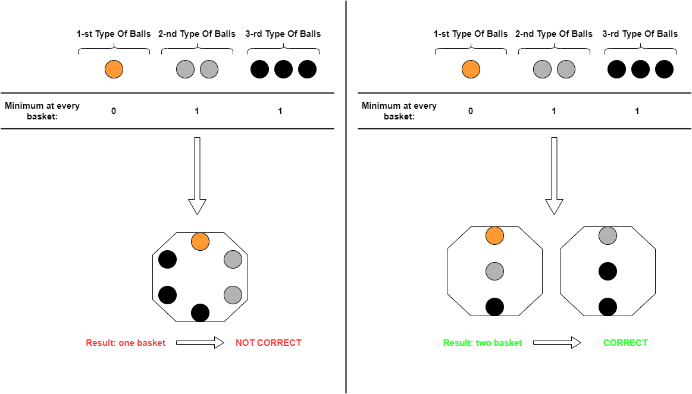
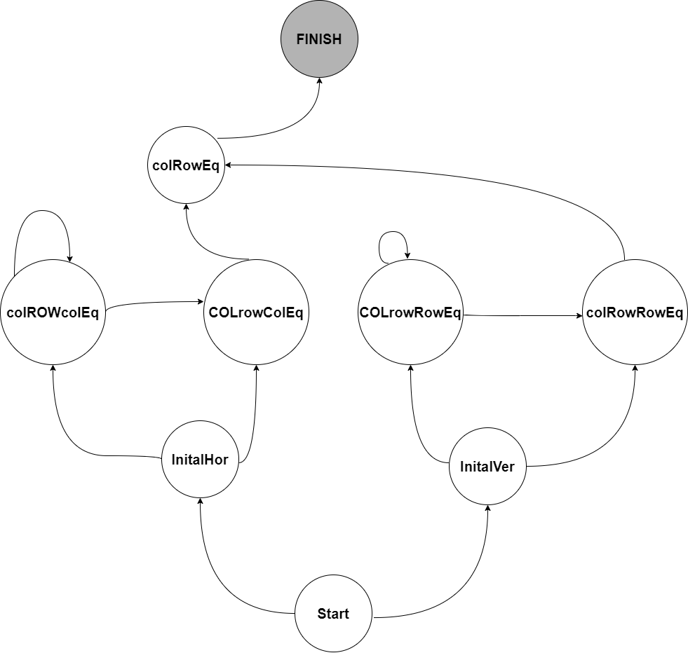

# Yandex Cup 2021


- [Installation](#anc1)
- [Usage](#anc2)
- [Contribution](#anc3)
- [About Tasks](#anc4)
   * [Task A](#anc4_A)
   * [Task B](#anc4_B)
   * [Task C](#anc4_C)
   * [Task D](#anc4_D)

---
Solving tasks at the open online championship for developers - [Yandex Cup 2021](https://yandex.ru/cup/).</br>
Implemented by [Java 15](https://www.oracle.com/java/technologies/javase/jdk15-archive-downloads.html).

<a id="anc1"></a>

## Installation
- The sources can be downloaded from the [Github repo](https://github.com/rrtty0/YandexCup_2021.git).

* You can either clone the public repository:
```
        $ git clone https://github.com/rrtty0/YandexCup_2021.git 
```
<a id="anc2"></a>

## Usage

- To use this sources you must downloaded [JDK 15](https://www.oracle.com/java/technologies/javase/jdk15-archive-downloads.html).

<a id="anc3"></a>

## Contribution
1. _Clone repo_ and _create a new branch_:
```
        $ git clone https://github.com/rrtty0/YandexCup_2021.git
        $ git branch name_for_new_branch
        $ git checkout name_for_new_branch
```
2. _Make changes_ and _test_
3. _Submit Pull Request_ with comprehensive description of changes

<a id="anc4"></a>

## About Tasks
The algorithm section consists of several tasks, the conditions for which are presented in the corresponding folders of the [repository](https://github.com/rrtty0/YandexCup_2021.git). The general approach to problem solving is briefly described below.

---

<a id="anc4_A"></a>

### Task A
- The condition of the task can be found [here](./Algorithms/A/conditions.pdf).
- The input strings are split into separate words using a regular expression, after which 2 data arrays are formed with the values `True` and `False`. Comparison of arrays is carried out from the most significant bit.


---

<a id="anc4_B"></a>

### Task B
- The condition of the task can be found [here](./Algorithms/B/conditions.pdf).
- To determine the possibility of composing a picture from the given tiles, the picture is divided into separate tiles, starting from the upper left corner and ending with the lower right corner. After that, tiles from the original list are superimposed on each part of the picture, and if there is no suitable tile from the original list for at least one part of the picture, then the result of the program's work is `NO`, but if for each part of the picture there is a tile from the original list, then the result of the program is `YES`.


---

<a id="anc4_C"></a>

### Task C
- The condition of the task can be found [here](./Algorithms/C/conditions.pdf).
- It is necessary to fill the baskets with balls in such a way to maximize the number of baskets (subject to conditions). To solve, it is necessary to determine the maximum possible number of baskets (it is not more than the total number of balls divided by the sum of the minimum boundaries for each balls and is among the divisors of the total number of balls). Each such number of baskets is checked for usability (from largest to smallest).


---

<a id="anc4_D"></a>

### Task D
- The condition of the task can be found [here](./Algorithms/D/conditions.pdf).
- The key approach is that there is no need to memorize the contents of the matrix, you just need to know its size, the state in which it is located, as well as the conditions for transitions from one state to another (states are highlighted and described in [this file](./Algorithms/D/src/rrtty0/cup/yandex/State.java)).
